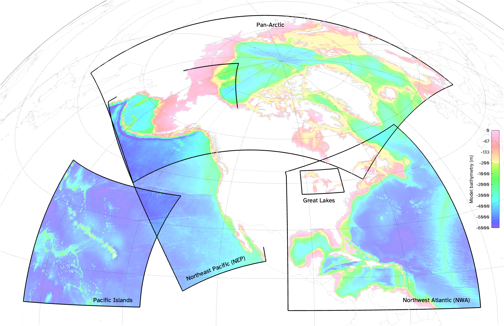
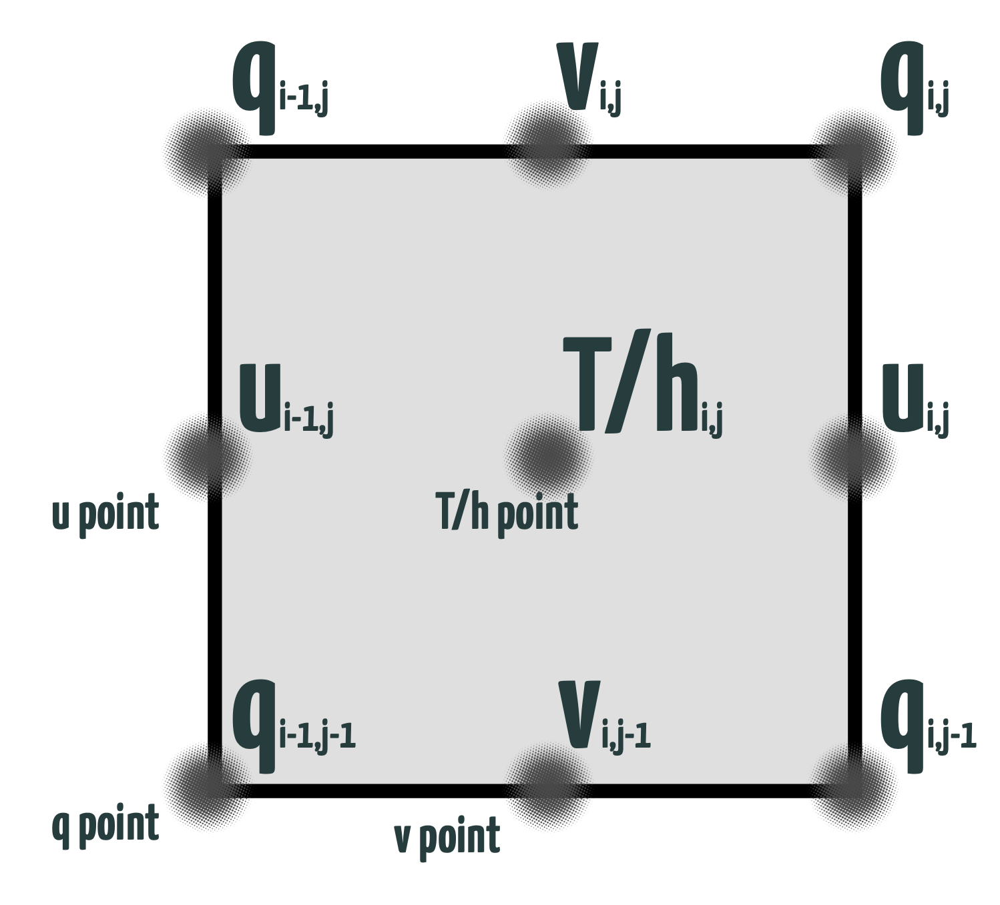
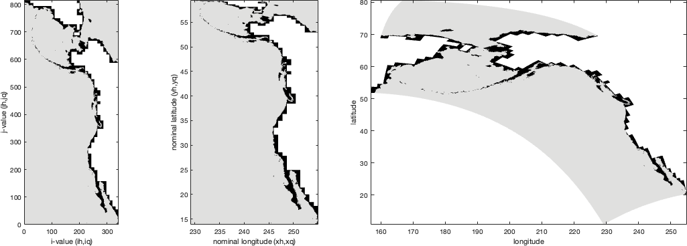
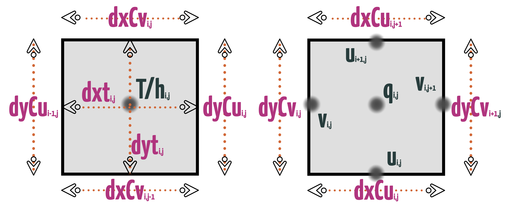

# The CEFI Dataset

## Introduction

The workflows within this document rely on MOM6-NEP regional model output that can be found in one of two locations.  

The first is the official [CEFI Data Portal](https://psl.noaa.gov/cefi_portal/), with individual file-like datasets downloaded via the OpenDAP protocol from the [CEFI THREDDS Data Server](https://psl.noaa.gov/thredds/catalog/Projects/CEFI/regional_mom6/cefi_portal/catalog.html).

Data is also sometimes written to and read from a local location with a Portal-like folder structure.  This option is usually reserved for simulation output that needs to be accessed before it has been fully quality-controlled for upload to the Portal, or for Alaska-specific subregions and near-real-time extensions that are not part of the official operational CEFI dataset.  This local dataset follows a similar folder and file naming structure as the Portal, allowing for interchangable use of data access functions across these locations.  Workflow code that targets local data will only be fully functional on a machine with access to the local drive, but is provided here for methods transparency.  Where possible, code references publicly-accessible datasets. 

All datasets follow a hierarchical folder structure:

`<region>/<subdomain>/<experiment_type>/<output_frequency>/<grid_type>/<release>/`

and file naming scheme:

`variable_name.region.subdomain.experiment_type.output_frequency.grid_type.rYYYYMMDD.YYYY0M-YYYY0M.nc`

The following sections provide backgorund information that can help users sort through this dataset and understand the folder/file organizational structure.  This information applies to all CEFI MOM6 output, not just the northeast Pacific.

## Regions

The CEFI project includes regional MOM6 configurations for five different domains:

{#fig-cefigrids}

These five regions cover the entirety of the US's federally-managed oceans, plus the Great Lakes.  

- Northwest Atlantic (NWA): New England, Mid-Atlantic, South Atlantic, Caribbean, and Gulf
- Northeast Pacific (NEP): Alaska (Bering Sea, Aleutian Islands, and Gulf of Alaska), Washington, Oregon, and California
- Pan-Arctic: Alaska (Chukchi Sea, Beaufort Sea)
- Pacific Islands: Western Pacific
- Great Lakes

:::{.callout-note}
The Alaska region falls in the overlap region between the NEP and Pan-Arctic grids.  For most applications, the NEP domain will be more appropriate when looking at regions south of Bering Strait (the Bering Sea, Aleutian Islands, or Gulf of Alaska), while the Pan-Arctic domain will be more appropriate for regions north of Bering Strait (Chukchi Sea).
:::

## Subdomains and grid types

The subdomain and grid type selectors are both related to how the 4D model space is subsetted.  It's useful to first understand the horizontal and vertical structure of the MOM6 model itself.

### The native (raw) horizontal grid

#### The Arakawa C grid

MOM6 uses an Arakawa C grid, which co-locates different types of model variables in different parts of the model grid cells, as follows:

```{matlab}
%| label: fig-arakawagrid
%| fig-cap: Schematic of the Arakawa C grid, showing positioning of tracer (h- or T-), corner (C- or q-), u-, and v-points, as well as indices for arrays within the model (i,j) and dimensions in files (iq,jq,ih,jh). 
%| code-fold: true

iq = 0:2;
ih = 0.5:1.5;

[iqg,jqg] = ndgrid(iq,iq);
[ihg,jhg] = ndgrid(ih,ih);
[iug,jug] = ndgrid(iq,ih);
[ivg,jvg] = ndgrid(ih,iq);

hf = figure; hf.Position(3:4) = [600 600];
axes;
hold on;
scatter([iqg(:); ihg(:); iug(:); ivg(:)], ...
        [jqg(:); jhg(:); jug(:); jvg(:)], ...
        100, ...
        [ones(numel(iqg),1)*1; ones(numel(ihg),1)*2; ones(numel(iug),1)*3; ones(numel(ivg),1)*4], ...
        'filled', 'markeredgecolor', 'k');
cmap = [...
            0.4      0.76078      0.64706
        0.98824      0.55294      0.38431
        0.55294      0.62745      0.79608
        0.90588      0.54118      0.76471];
set(gca, 'colormap', cmap, 'clim', [0.5 4.5], ...
    'xlim', [iq(1) iq(end)+0.5], 'ylim', [iq(1) iq(end)+0.5], ...
    'dataaspectratio', [1 1 1], 'visible', 'off');

xt = {...
    iq -0.2 compose("iq=%.0f", iq)
    ih -0.2 compose("ih=%.1f", ih)
    iq -0.1 compose("i=%.0f", iq)
    ih -0.1 compose("i=%.0f", iq(1:2))};

yt = {...
    iq-0.05 -0.15 compose("iq=%.0f", iq)
    ih-0.05 -0.15 compose("ih=%.1f", ih)
    iq+0.05 -0.15 compose("i=%.0f", iq)
    ih+0.05 -0.15 compose("i=%.0f", iq(1:2))};

txplot = @(x,y,t) text(x, ones(size(x))*y, t, 'horiz', 'center');
typlot = @(y,x,t) text(ones(size(y))*x, y, t, 'horiz', 'center');

for ii = 1:size(xt,1)
    txplot(xt{ii,:});
    typlot(yt{ii,:});
end

text(ih(1)+0.03, ih(1)-0.03, 'T/h-point', 'color', cmap(2,:), 'horiz', 'left', 'vert', 'top', 'fontweight', 'b')
text(iq(2)-0.03, iq(2)-0.03, 'C/q-point', 'color', cmap(1,:), 'horiz', 'right', 'vert', 'top', 'fontweight', 'b')
text(ih(1), iq(1)+0.06, 'v-point', 'color', cmap(4,:), 'horiz', 'center', 'vert', 'base', 'fontweight', 'b')
text(iq(1)+0.06, ih(1), 'u-point', 'color', cmap(3,:), 'horiz', 'left', 'vert', 'middle', 'fontweight', 'b')

drawbrace([iq(2), ih(2)], [iq(3) ih(2)], 10, 'color', cmap(2,:)); % dxt
text(mean(iq(2:3)), ih(2)+0.12, "dxt", 'color', cmap(2,:), 'vert', 'base');
drawbrace([ih(2), iq(2)], [ih(2) iq(3)], 10, 'color', cmap(2,:)); % dyt
text(ih(2)-0.12, mean(iq(2:3)), "dyt", 'color', cmap(2,:), 'horiz', 'right');

drawbrace([iq(2), iq(2)], [iq(3) iq(2)], 10, 'color',  cmap(3,:)); % dxCv
text(mean(iq(2:3)), iq(2)+0.12, "dxCv", 'color', cmap(3,:), 'vert', 'base');
drawbrace([ih(1), ih(1)], [ih(1) ih(2)], 10, 'color',  cmap(3,:)); % dyCv
text(ih(1)-0.12, mean(ih(1:2)), "dyCv", 'color', cmap(3,:), 'horiz', 'right', 'vert', 'top');

drawbrace([ih(1), ih(1)], [ih(2) ih(1)], 10, 'color',  cmap(4,:)); % dxCu
text(mean(ih(1:2)), ih(1)+0.12, "dxCu", 'color', cmap(4,:), 'vert', 'base');
drawbrace([iq(2), iq(2)], [iq(2) iq(3)], 10, 'color',  cmap(4,:)); % dyCu
text(iq(2)-0.12, mean(iq(2:3)), "dyCu", 'color', cmap(4,:), 'horiz', 'right');

gridxy(iq,iq);
```

<!-- {width=40% fig-align="left" #fig-arakawac} -->

Within each grid cell, there are few primary locations where data will be located:

- **h-points** (also sometimes known as T-points): These are located in the center-ish of each grid cell, and are where most of the tracer variables --- like temperature, salinity, and all the biogeochemical variables --- are located.
- **u-points** and **v-points**: These are located in the middle-ish of the grid cell edges, and are where variables related to velocities are found.  They are staggered such that things pertaining to the x-direction (u-points) are offset from those pertaining to the y-direction (v-points).^[This staggering of variables is employed to retain non-divergence of the flow at all times, and it allows for more accurate representation and computation of physical quantities in numerical models.]
- **q-points**: These are the grid cell corners, and are where variables related to vorticities are found.  q-point coordinates are also useful when plotting h-point data, since the adjacent q-points define the bounds of the grid cell in which tracer data is located.

All points are indexed with an (i,j) scheme, where i increases in the x direction (east-ish for most domains) and j increases in the y direction (north-ish for most domains).  

:::{.callout-note}
The indexing uses a north-east convention, meaning that q(i,j), u(i,j), and v(i,j) are north and/or east of h(i,j) in the MOM6 calculations.  This is primarily relevent if one is looking at array-based equations in the model code.
:::

#### Geographical coordinates for the raw grid {#sec-geocoord}

While the diagram above shows a grid cell as a neat square, most MOM6 grids (including all the CEFI ones) are neither orthogonal nor east/north-aligned.  This means that the x- and y- (i.e., i- and j-) axes do not align neatly with longitude and latitude axes.  

The geographical coordinates for all points can be found in the following variables:

- h-points: `geolat`, `geolon`
- q-points: `geolat_c`, `geolon_c`
- u-points: `geolat_u`, `geolon_u`
- v-points: `geolat_v`, `geolon_v` 

See the static variable (@sec-static) discussion below for more information on how to access these data.

#### Indexing the horizontal grid

Each raw-grid variable file includes a set of coordinate variables that describe the along-axis dimensions of the grid that the variable lies on.  Depending on the archiving options used for a given simulation, and whether the variable derives from the ocean or ice module, you will find one of the following sets of dimensions with associated coordinate variables:

- **ih, jh, iq, jq**:  integer-like indices that represent where each point is in grid-cell space, with i along the x axis and j along the y axis.  The q-points count in whole numbers (0, 1, 2, ..., N), while the h-points are staggered halfway (0.5, 1.5, 2.5, ..., N-0.5).

- **xh, yh, xq, yq**: "nominal longitude/latitude" values.  These reflect the location of the grid's first row and column in geographical space.  But despite the label, these are *not* the true geographical coordinates of the points.  Depending on the characteristics of a grid, plotting values using these coordinates may look almost correct (NWA) or very distorted (NEP, Arctic) in terms of geographic location.

- **xT, yT, xTe, yTe**: identical to the above "nominal longitude/latitude" values, but for variables that derive from the ice model rather than the ocean model.  

To get the true geographic coordinates associated with each variable, you need the geolat/geolon variables (see @sec-geocoord).  These are not included with each individual raw-grid file due to storage space considerations, but are instead found in the static (@sec-static) collection.

Below, you can see the results of visualizing the northeast Pacific (NEP) grid using these various dimensions and/or coordinates.

```{matlab}
%| label: fig-dimensioncoord
%| fig-cap: The NEP grid plotted using cartesian i/j space, cartesian nominal lat/lon, and geographic coordinates using an equidistant conic projection.
%| code-fold: true

addpath('../code');
Copt = cefiportalopts('region', 'nep', ...
                   'release', 'r20250912', ...
                   'freq', 'monthly'); 

C = cell(2,1);
C{1} = readcefigridvars(Copt, {'ih', 'jh', 'geolat_c', 'geolon_c', 'iq', 'jq', 'wet'}, 'expandname', false);
C{2} = readcefigridvars(Copt.setopts('release', 'r20241015'), {'xh', 'yh'}, 'expandname', false);

padend = @(x) [x nan(size(x,1),1); nan(1,size(x,2)+1)];

h.fig = figure;
h.fig.Position(3:4) = [1000 400];
h.t = tiledlayout(1,4);
h.t.TileSpacing = 'tight';
h.t.Padding = 'compact';

h.ax(1) = nexttile(h.t);

pcolor(h.ax(1), C{1}.iq, C{1}.jq, padend(C{1}.wet'));
shading flat;
xlabel('i-value (ih,iq)');
ylabel('j-value (jh,jq)');
axis tight equal;

h.ax(2) = nexttile(h.t);

pcolor(h.ax(2), C{2}.xh, C{2}.yh, C{1}.wet');
shading flat;
xlabel('nominal longitude (xh,xq)');
ylabel('nominal latitude (yh,yq)');
axis tight equal;

h.ax(3) = nexttile(h.t, [1 2]);

[latlim(1), latlim(2)] = bounds(C{1}.geolat_c(:));
[lonlim(1), lonlim(2)] = bounds(C{1}.geolon_c(:));
worldmap(latlim, lonlim);
setm(h.ax(3), 'flinewidth', 1);
pcolorm(C{1}.geolat_c, C{1}.geolon_c, padend(C{1}.wet));

set(h.ax, 'colormap', cmocean('gray'), 'clim', [0 1.1], 'layer', 'top');
```

<!-- {#fig-coordinates} -->

#### Static variables in the CEFI data {#sec-static}

Static variables refer to variables that do not vary over time.  You'll find these variables grouped together in files named "ocean_static" or "ice_static" that are duplicated throughout the CEFI file tree (with usually one copy under each simulations monthly and daily data folders).

The static collections include the following variables:

- **geolat/geolon variations**: Geographic coordinates (lat/lon) for the h-, q-, u-, and v-grids.
- **areacello variations**: derived from "area [of] cell o[cean]", these hold the areas of the grid cells
- **deptho**: depth of each ocean grid cell
- **Coriolis**: Coriolis parameter at each corner point
- **wet variations**: wet/dry mask indicating which grid cells are ocean (1) and which are land (0)
- **dx/dy variations**: geometry variables defining various distances across and between grid cells.  These are handy shortcuts when you need to calculate areas, derivatives, etc (@fig-arakawagrid).
- **COSROT,SINROT**: found in the ice static collection, these are rotation values to transform directional values from along-grid orientation to geographic east/north orientation.

<!-- {fig-align="left" #fig-arakawacdist} -->

### The regridded (regrid) option

The CEFI datasets include output in both native-grid (`raw`) and regridded (`regrid`) formats.  

The regridded data has been interpolated to a regular, east/north-oriented grid, with vector coordinate data (`lat`, `lon`, and `time`) included within the individual data files for easy access.  This makes the files easy to work with and compatible with most netCDF-reading software using out-of-the-box settings.

There are some tradeoffs when opting for this data, though.  First, for data size considerations, the choice was made to maintain the approximate grid size when moving from the native grid to the regridded one.  For nearly rectilinear grids (e.g. the northwest Atlantic (NWA)), this preserves a similar spatial resolution to the native grid.  But for the diagonally-oriented northeast Pacific (NEP), the regridding loses significant resolution in the southern portion of the domain and increases the sparsity of the dataset.

```{matlab}
%| label: fig-rawregrid
%| fig-cap: Grid scale resolution (square root of grid cell area) in the a) raw versus b) regridded datasets for the NWA and NEP regions.
%| fig-subcap:
%|   - Raw
%|   - Regridded
%| code-fold: true

Copt = cefiportalopts('region', 'nep', ...
                      'release', 'latest', ...
                      'freq', 'monthly'); 

% raw-grid area: in static files

Rw.nep = readcefigridvars(Copt, {'areacello', 'geolat_c', 'geolon_c', 'wet'}, 'expandname', false);
Rw.nwa = readcefigridvars(Copt.setopts('region','nwa'), {'areacello', 'geolat_c', 'geolon_c', 'wet'}, 'expandname', false);

% regridded: calculate based on coordinates

fname = Copt.setopts('grid', 'regrid', 'region', 'nep').cefifilelist('tob*', '*');
Rg.nep = ncstruct(fname, 'tob', 'lat', 'lon', struct('time', [1 1 1]));
fname = Copt.setopts('grid', 'regrid', 'region', 'nwa').cefifilelist('tob*', '*');
Rg.nwa = ncstruct(fname, 'tob', 'lat', 'lon', struct('time', [1 1 1]));

ell = referenceEllipsoid('earth', 'km');
dfun = @(a,b) distance(a(:,1), a(:,2), b(:,1), b(:,2), ell);

fld = ["nep", "nwa"];

rgarea = cell(size(fld));
for ii = 1:length(fld)

    dln = mean(diff(Rg.(fld{ii}).lon));
    dlt = mean(diff(Rg.(fld{ii}).lat));

    [lt,ln] = ndgrid(wrapTo360(Rg.(fld{ii}).lat), Rg.(fld{ii}).lon);
    ln1 = ln - dln/2;
    ln2 = ln + dln/2;
    lt1 = lt - dlt/2;
    lt2 = lt + dlt/2;

    rgarea{ii} = arrayfun(@(a,b,c,d) areaquad(a,b,c,d, ell), lt1, ln1, lt2, ln2);
end

for ii = 1:length(fld)
    mask = isnan(Rg.(fld{ii}).tob);
    rgarea{ii}(mask') = NaN;
end

% Plot


latlim = [5 81];
lonlim = [156 324];

hf = figure;

ax(1) = worldmap(latlim, lonlim);
for ii = 1:length(fld)
    atmp = Rw.(fld{ii}).areacello*1e-6; % m^2 -> km^2
    atmp(Rw.(fld{ii}).wet == 0) = NaN;
    pcolorm(Rw.(fld{ii}).geolat_c, Rw.(fld{ii}).geolon_c, sqrt(padarray(atmp, [1 1], 'post')));
end

hf(2) = figure;

ax(2) = worldmap(latlim, lonlim);
for ii = 1:length(fld)
    pcolorm(Rg.(fld{ii}).lat, Rg.(fld{ii}).lon, sqrt(rgarea{ii}));
end

set(ax, 'clim', [5 18], 'position', [0 0 1 1], 'xlim', [-5e6 ax(1).XLim(2)]);
arrayfun(@(x) setm(x, 'frame', 'off', 'fontsize', 8), ax);

cb = colorbar('north');
cb.Position = [0.7 cb.Position(2)-0.04 0.2 cb.Position(4)];
set(cb, 'AxisLocation', 'out', 'fontsize', 8, 'tickdir', 'out');
xlabel(cb, 'Resolution (km)');
```

Even without loss of resolution, the interpolation process leads to small changes in values relative to the "true" values in the model that may be important if your use case relies on precise conservation of mass, momentum, etc.  While it makes analysis a bit more complex, this author recommends working with the raw datasets whenever possible.

Only h-point variables are available in the regridded datasets, so any analysis of velocities will require the raw data.

### The vertical grid

#### Internal scheme (z*)

Internally, the MOM6 model uses a vertical remapping scheme, known as the Arbitrary Lagrangian Eulerian (ALE) algorithm, that allows MOM6 simulations to be configured with one of many different vertical coordinate schemes, including geopotential (z or z*), isopycnal, terrain-following, and hybrid schemes.  

Currently, the CEFI regional model configurations use a z* vertical coordinate.  This means the vertical levels are at fixed depths, except the layer interfaces move a little in response to changes in sea surface height.

Depth is measured relative to sea level, positive up and negative down, so most ocean depth coordinate values will be negative.

#### Vertical remapping for output diagnostics

While the vertical layers are time-varying internally to the model, the output diagnostics found in the CEFI portal have all been vertically remapped to constant depth levels, with layer thickness ranging from 5 to 250 m as follows:

|Upper depth (m)| Lower depth (m)| Resolution (m)
-----:| ----:| ---------:
|  0 | 50 | 5
| 50 | 150 | 10
| 150 | 300 | 25
| 300 | 500 | 50
| 500 | 1500 | 100
| 1500 | 6500 | 250

The remapping process is conservative, meaning that these values can be used to calculate mass and momentum budgets without needing access to the native vertical grid.

Depth layer interface depth (`z_i`) and mid-layer depth (`z_l`) variables can be found in each of the 3D variable files.

##  Experiment types

Regional model configurations can be used to run a wide variety of different types of simulations.  This is accomplished by using different datasets as the input forcing for the models.  

A regional ocean model always requires external input to prescribe what is happening at the surface and lateral boundaries. That input usually comes from the output of a larger- and coarser-scale global model or a reanalysis that combines a model with observations.  These boundary conditions play a strong driving role in any simulation, and a regional model will inherit some of both the skill and biases of its parent model/reanalysis.  

A regional model is more than just a high-resolution filter for the parent model, though; it can resolve dynamics not possible at a coarser scale, and also can add new processes not present in the parent (for example, extra biological complexity).  This can alleviate biases from the parent model.  But at the same time, some biases can be amplified in the regional model output.  The resulting features in a regional model will always be a combination of the parent model’s dynamics and its own internal dynamics.

The CEFI model configurations have been (or will be) used to run simulations across different time scales, including hindcasts, forecasts, and long-term outlooks.  Here, we describe each of these.

### Hindcasts

Hindcast simulations are intended to represent historical periods with as much accuracy as possible, and with direct year-to-year correspondence to real-world events.  They are primarily forced by reanalyses or other observation-based datasets. 

Hindcasts can be used to measure the skill of the model compared to observations.  They also play many roles in research and ecosystem management: to fill in spatiotemporal gaps in observations, to provide a physical basis to drive fisheries and other ecosystem models, to initialize forecasts, and many more.  

Note that the CEFI hindcast simulations do not themselves assimilate observations; they are simply forced by a data-assimilative parent model.

More info:

- @ross_high-resolution_2023: NWA domain configuration and hindcast simulation documentation paper 
- @drenkard_regional_2025: NEP domain configuration and hindcast simulation documentation paper


### Forecasts

Forecast simulations simulate future periods.  The CEFI project includes both seasonal and decadal forecasts, with a few associated simulation types each.

#### Seasonal forecasts

CEFI seasonal forecasts predict conditions 0-12 months into the future.  They are released 4 times per year (initialized on January 1, April 1, July 1, and September 1 of each year).  

The CEFI seasonal forecasts are driven by GFDL's SPEAR (**S**eamless System for **P**rediction and **EA**rth System **R**esearch) model, a global configuration of the MOM6 ocean model, LM4 land model, and SIS2 sea ice model designed with seasonal to decadal time scales in mind.  CEFI seasonal forecast forcings use the SPEAR_MED configuration, which has 0.5-deg atmospheric resolution and 1-deg ocean resolution. 

While initial conditions strive to match real-world conditions at the forecast starting time, the remainder of the simulation is free-running.

Due to the chaotic nature of the Earth system, very small differences in conditions at one time can lead to large differences in future values.  The SPEAR simulations account for this by running multiple forecast simulations with slight differences in their initial conditions, producing an ensemble of forecasts that can be used to quantify the uncertainty of predictions. The CEFI regional seasonal forecasts downscale 10 of these ensemble members for each seasonal forecast initialization date.

#### Seasonal retrospective forecasts (reforecasts)

Retropective forecasts are simply forecasts initialized at a past date.  They use the same model framework and SPEAR-based forcing as the seasonal forecasts.  

Retrospective forecasts are primarily used to skill test a forecast model.  By comparing the suite of reforecasts to observations (or to a hindcast), one can quantify the model's ability to forecast features of interest.

More info:

- @Ross2024-pf: NWA seasonal forecast skill assessment

#### Seasonal forecast initializations (partial year hindcast)

The CEFI seasonal forecasts are initialized from a hindcast simulation, rather than directly from observations.  This allows the starting conditions to be as close to real-world as possible while avoiding spinup artifacts that would arise from starting from a reanalysis product directly.

The CEFI hindcast simulations are updated once per year, while forecasts are produced four times per year.  The seasonal forecast initializations extend the hindcasts from the end of the last annual hindcast release to the starting date of the forecast.  These updates require the use of some interim data products, departing from the published hindcast forcing configurations.  

In addition to their use as forecast initialization, data from these simulations may be used to get more recent estimates of ocean and biogeochemical conditions.  However, users should keep in mind the interim nature of the forcing used for these simulations, and it is recommended that they replace use of seasonal forecast initialization data with hindcast data once it becomes available.

### Decadal forecasts

CEFI decadal forecasts predict conditions 0-10 years into the future.  They are released once per year.

Like the seasonal forecasts, the CEFI decadal forecast input forcing comes from the SPEAR model, but using the slightly lower-atmospheric-resolution SPEAR_L0 configuration that is optimized for longer simulations.  

Like the seasonal forecasts, each decadal forecast includes a 10-member ensemble to account for uncertainty.

More info:

- @Koul2024-ko: NWA decadal forecast paper

#### Decadal forecast initializations

The CEFI decadal forecasts are initialized from a downscaled version of the SPEAR_L0 historical climate simulations.  These simulations run the SPEAR_L0 configuration with light restoring to observations.  This initialization techniqe allows the model forecasts to gain "memory" of real-world phenomena (like the specific timing of El Nino events and heat waves) that contribute to skillful prediction while still maintaining it's own internally-derived dynamics.

In addition to serving as an initialization dataset for decadal forecast, these decadal forecast initialization simulations can supplement the hindcast simulations.  While the input forcing is not as tightly tied to observations as the reanalysis-forced hindcasts, the simulations cover a longer period (1965--2022) and can sometimes suffice as a hindcast extension when simulation data from earlier years are needed.

### Multi-decadal outlooks

Multi-decadal outlooks focus on predicting the change in the Earth system over multidecadal to century time scales.  On these time scales, the conditions at the start of the simulation are much less important than in short-term forecasts.  Instead, changes in long-term drivers, especially the concentrations of CO2 and other greenhouse gasses in the atmosphere, control the outcomes.  

The CEFI multi-decadal outlooks are driven by selected simulations from the 6th Coupled Model Intercomparison Project (CMIP6).

#### Historical

The CMIP6 historical simulations cover the period of 1850--2014, and are forced by historical emissions and radiative forcing.  Apart from these upper atmosphere forcings, the models are free running and not influenced by observations.  This means that the models in the suite should  skillfully reproduce mean conditions and the frequency of events like climate oscillations (ENSO, PDO) and extremes (heat waves, storms, etc), but there is not a 1:1 correspondance with real world events.

The CEFI simulations downscale the latter portion (1950--2014) of the historical runs from five parent models: GFDL-ESM4, IPSL-CM6A, UKESM1, CMCC-ESM2, and CNRM-ESM2-1.  These models include the necessary physical and biogeochemical forcing/initial variables required by the CEFI regional model configurations and sample the span of climate sensitivities within the larger suite of models.

The historical simulations are used to initialize the various SSPs and to provide a baseline against which future change is measured.  They can also be used to assess bias relative to hindcasts or to observations.

#### SSPs

The Shared Socioeconomic Pathways (SSP) in CMIP6 reflect potential storylines for how the earth might change under different assumptions population growth, development, and mitgation strategies.  These simulations run from 2015--2100.

For each of parent model, the CEFI suite downscales four different SSPs: SSP1-2.6, SSP2-4.5, SSP3-7.0, and SSP5-8.5.

More info:

- 

## Output frequency

## Releases

## Variables

<!-- Notes -->
<!-- "10.5194/egusphere-2024-394" - preprint of Ross et al, 2024 -->
<!-- "10.5194/gmd-2024-195" - discussions version of Drenkard et al., 2025 -->