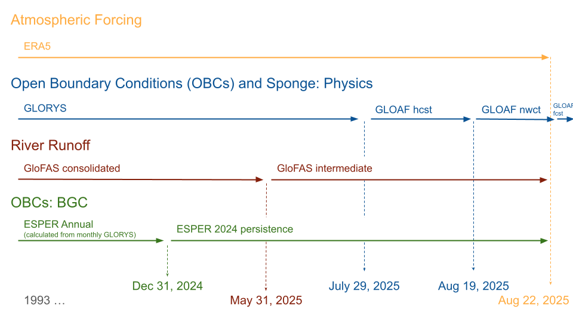

# ESR 2025: Methods

:::{.callout-note}
This is not an Ecosystem Status Report (ESR).  This is simply an analysis of regional model output intended to inform Alaska ESRs.
:::

## Background

Between 2024 and 2025, the regional modeling team at AFSC transitioned our regional model work from our previous focus on the Bering10K ROMS model [@gmd-2019-239] to the new Modular Ocean Model version 6 Northeast Pacific (MOM6-COBALT-NEP10k) model [@drenkard_regional_2025].  This transition is part of the Changing Ecosystem and Fisheries Initiative (CEFI).  The MOM6 model framework differs from ROMS in a few key ways, most notably in its ability to better resolve bathymetry along the shelf break.  The NEP10k domain also encompasses the Bering Sea, Gulf of Alaska, and Aleutian Islands, allowing us to provide contributions to all three ESRs.  Initial comparison between ROMS Bering10K and MOM6-COBALT-NEP10k suggests that the latter model is performing similarly or better with respect to the temperature metrics in the Bering Sea region.  A more complete comparison between these two models will be forthcoming.

## Simulation details

For our 2025 ESR contribution, we extended the primary CEFI hindcast (which runs through the end of 2024) through Aug. 22, 2025 to cover the end date of the last 2025 AFSC groundfish survey.  This required the use of a few intermediate forcing datasets to extend the simulation beyond the end of those used in the @drenkard_regional_2025 standard configuration (@fig-esr25force, @tbl-esr25force).  

For atmospheric forcing, we used ERA5 surface winds, temperature, precipitation, sea level pressure and downwelling solar and thermal radiation.  This data product was available through the simulation end date.

Open ocean boundary conditions and boundary sponges for temperature, salinity, velocities, and sea surface height were generated from GLORYS. At the time of simulation the GLORYS Reanalysis only extended to July 29, 2025. Therefore, for subsequent days, we used output from the GLORYS-related Analysis and Forecast (GLOAF) product. Diminishing persistence weighting, specifically weighting to the last day of the Reanalysis, was applied to the first four days of the hindcast to mitigate any localized discontinuities between the GLORYS Reanalysis and GLOAF hindcast products. The 2025 date ranges for each product used for both daily boundary conditions and monthly mean sponges for days beyond the extent of the GLORYS reanalysis were: July 30-August 2 (weighted GLOAF hindcast), August 3 - August 19 (GLOAF hindcast), August 20-26 (GLOAF nowcast), and August 27-31 (GLOAF forecast). The sponge for September (as an interpolation endpoint for dates in the second half of August) was a persistence of the August sponge. 

Freshwater runoff was prescribed using the consolidated GloFAS product up until May 31, 2025; after this date, we used the GloFAS intermediate product.

Biogeochemistry boundary conditions were prescribed as climatologies with the exception of total alkalinity and dissolved inorganic carbon. These boundary terms were defined as annual mean values, generated using ESPER and monthly temperature and salinity fields from GLORYS. Unique annual means were calculated through 2024; boundary conditions for 2025 were prescribed as a persistence of the 2024 annual mean values.

{#fig-esr25force}

| Abbreviation | Full name | References |
|:-|:-----|:---|
ERA5 | European Centre for Medium-Range Weather Forecasts Reanalysis 5 | @hersbach2020era5 |
GLORYS | 1/12° Global Ocean Physics Reanalysis | @jean2021copernicus |
GLOAF | 1/12° Global Ocean Physics Analysis and Forecast | |
GloFAS | Global Flood Awareness System, version 4.0 | @harrigan2020glofas; @grimaldi2023glofas |
ESPER | Empirical Seawater Property Estimation Routines Locally Interpolated Regressions | @carter_new_2021

: Detailed description of the external forcing datasets referred to in this description. {#tbl-esr25force}

## Dataset extraction

The above simulations were run by lead MOM6-NEP modeler Liz Drenkard in late Aug/early September of 2025.  Data was archived under `/archive/e1n/fre/cefi/NEP/2025_07/NEP10k_202507_physics_bgc/gfdl.ncrc6-intel23-repro/history/` on GFDL's post-processing and analysis node (PPAN).  We extracted a limited portion of the dataset for local analysis, and applied version label e202507 to this dataset, reflecting the MOM6 executable's compilation date (also reflected in the archive path name).^[This simulation (through June 2025) was later uploaded to the [CEFI Data Portal](https://psl.noaa.gov/cefi_portal/) as release r20250912, reflecting the date it was uploaded to the Portal. This analysis was performed prior to that upload and naming, hence our use of a different label.] 

We extracted data variables currently discussed in the ESRs or used to contruct Ecological and Socioeconomic Profile (ESP) indicators: surface and bottom temperature, sea ice concentration, and bottom carbonate system variables.


```{bash}
#| file: ./esr2025_scripts/esr2025_data_extract.sh
#| eval: false
#| code-fold: true
```

## Persistence forecast calculation

At the 2025 Spring PEEC meeting (May 5, 2025), we first introduced the MOM6-COBALT-NEP10k model and provided a hindcast and persistence-based forecast of summer conditions.  That hindcast extension was very hastily assembled in response to the sudden discontinuation of near real time updates to the CFSv2 Operational Analysis, the primary forcing dataset used for our ROMS Bering10K simulation.  Like the simulation presented here, the PEEC simulation required a near real time extension to extend the primary hindcast (then through Dec. 31, 2023) through mid-April, 2025.  This simulation was labeled as version e202411 during our PEEC analysis.^[This simulation was briefly uploaded to the [CEFI Data Portal](https://psl.noaa.gov/cefi_portal/) as release r20250509, but later removed due to the bug discussed below.]

Prior to the summer ESR update, we discovered a bug in the scripts that prepared forcing for the near-real-time period of this e202411 simulation.  This bug reversed the grid orientation of the atmospheric forcing.  The warm conditions predicted at the Spring PEEC meeting were thus primarily a result of this bug.

For this summer update, we re-calculated an April-initiated persistence forecast using the e202507 version of the hindcast simulation to replace the buggy e202411 version.  This allows us to evaluate the forecast as it would have been without the buggy forcing.  The forecast was initialized April 11, 2025.

```{bash}
#| eval: false
#| code-fold: true
calculate_persis_forecast.sh --region nep \
                       --subdomain iq0-342jq446-743 \
                       --release e202507 \
                       --exptype hcast \
                       --ppdir /work/Kelly.Kearney/ak_cefiportal \
                       --vars tos,tob,btm_o2,btm_co3_sol_arag,btm_htotal,btm_co3_ion,pco2surf,siconc \
                       --filedatestr 20250101 \
                       --tindex 101
```

## Survey region averages

Spatially-averaged indices were calculated for each of the groundfish survey regions (@fig-ak-masks).  These indices are saved under the `ak_surveregion_avg` region-folder within the local dataset (short name `aksvyreg` in the file names.)

```{bash}
#| eval: false
#| code-fold: true
calculate_surveyregion_averages.sh --region nep \
                       --subdomain iq0-342jq446-743 \
                       --release e202507 \
                       --exptype hcast \
                       --ppdir /work/Kelly.Kearney/ak_cefiportal \
                       --maskbase ak_masks \
                       --maskdatestr 20240101
```


