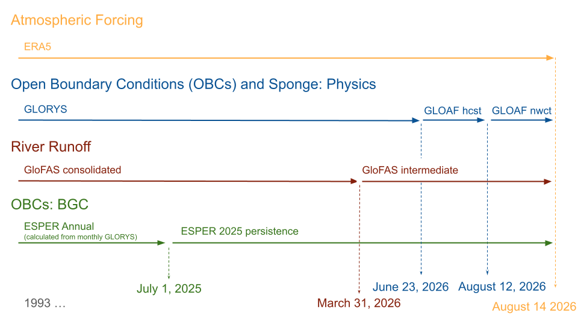

```{css, echo=FALSE}
code.sourceCode.r::before{content:'R'; float:right}
code.sourceCode.python::before{content:'Python'; float:right}
code.sourceCode.matlab::before{content:'MATLAB'; float:right}
code.sourceCode.bash::before{content:'bash'; float:right}
```

# ESR 2025: Methods

:::{.callout-note}
This is not an Ecosystem Status Report (ESR).  This is simply an analysis of regional model output intended to inform Alaska ESRs.
:::

## Background

Between 2024 and 2025, the regional modeling team at AFSC transitioned our regional model work from our previous focus on the Bering10K ROMS model [@gmd-2019-239] to the new Modular Ocean Model version 6 Northeast Pacific (MOM6-COBALT-NEP10k) model [@drenkard_regional_2025].  This transition is part of the Changing Ecosystem and Fisheries Initiative (CEFI).  The MOM6 model framework differs from ROMS in a few key ways, most notably in its ability to better resolve bathymetry along the shelf break.  The NEP10k domain also encompasses the Bering Sea, Gulf of Alaska, and Aleutian Islands, allowing us to provide contributions to all three ESRs.  Initial comparison between ROMS Bering10K and MOM6-COBALT-NEP10k suggests that the latter model is performing similarly or better with respect to the temperature metrics in the Bering Sea region.  A more complete comparison between these two models will be forthcoming.

## Simulation details

For our 2026 ESR contribution, we extended the primary CEFI hindcast (which runs through the end of 2025) through Aug. 14, 2025 to cover the end date of the last 2026 AFSC groundfish survey.  This required the use of a few intermediate forcing datasets to extend the simulation beyond the end of those used in the @drenkard_regional_2025 standard configuration (@fig-esr26force, @tbl-esr26force).  

For atmospheric forcing, we used ERA5 surface winds, temperature, precipitation, sea level pressure and downwelling solar and thermal radiation.  This data product was available through the simulation end date.

Open ocean boundary conditions and boundary sponges for temperature, salinity, velocities, and sea surface height were generated from GLORYS. At the time of simulation the GLORYS Reanalysis only extended to June 23, 2026. Therefore, for subsequent days, we used output from the GLORYS-related Analysis and Forecast (GLOAF) product. Diminishing persistence weighting, specifically weighting to the last day of the Reanalysis, was applied to the first four days of the hindcast to mitigate any localized discontinuities between the GLORYS and GLOAF products. The 2026 date ranges for each product used for both daily boundary conditions and monthly mean sponges for days beyond the extent of the GLORYS reanalysis were: June 24-27 (weighted GLOAF hindcast), June 28-August 12 (GLOAF hindcast), August 13-14 (GLOAF nowcast).

Freshwater runoff was prescribed using the consolidated GloFAS product up until March 31, 2025; after this date, we used the GloFAS intermediate product.

Biogeochemistry boundary conditions were prescribed as climatologies with the exception of total alkalinity and dissolved inorganic carbon. These boundary terms were defined as annual mean values, generated using ESPER and monthly temperature and salinity fields from GLORYS. Unique annual means were calculated through 2025; boundary conditions for 2026 were prescribed as a persistence of the 2025 annual mean values.

{#fig-esr26force}

| Abbreviation | Full name | References |
|:-|:-----|:---|
ERA5 | European Centre for Medium-Range Weather Forecasts Reanalysis 5 | @hersbach2020era5 |
GLORYS | 1/12° Global Ocean Physics Reanalysis | @jean2021copernicus |
GLOAF | 1/12° Global Ocean Physics Analysis and Forecast | |
GloFAS | Global Flood Awareness System, version 4.0 | @harrigan2020glofas; @grimaldi2023glofas |
ESPER | Empirical Seawater Property Estimation Routines Locally Interpolated Regressions | @carter_new_2021

: Detailed description of the external forcing datasets referred to in this description. {#tbl-esr26force}

## Dataset extraction

The above simulations were run by lead MOM6-NEP modeler Liz Drenkard in mid-August of 2026.  Data was archived under `/arch0/e1n/fre/cefi/NEP/2026_04/NEP10k_202604_physics_bgc_uv_sponge_august_extension/gfdl.ncrc6-intel25-repro/history/` on GFDL's post-processing and analysis node (PPAN).  We extracted a limited portion of the dataset for local analysis, and applied version label e202604 to this dataset, reflecting the MOM6 executable's compilation date (also reflected in the archive path name).^[This simulation, excluding the spring and summer near-real-time extensions (e.g, through December 2025 only) is available through the [CEFI Data Portal](https://psl.noaa.gov/cefi_portal/) as release r20260701, reflecting the date it was uploaded to the Portal. Here, we use the same version label that was used for the spring near-real-time extension, which preceeded the upload to the portal and hence required a different label.] 

The previously-existing spring near-real-time extension output files were renamed with the suffix `*.hcast_nrt1.daily.e202604.20260101.nc`.  We note that this summer near-real-time simulation is not an extension of the spring near-real-time hindcast, but rather a replacement.  We then extracted data variables currently discussed in the ESRs or used to contruct Ecological and Socioeconomic Profile (ESP) indicators: surface and bottom temperature, sea ice concentration, and bottom carbonate system variables.


```{bash}
#| file: ./scripts/esr2026_data_extract.sh
#| eval: false
#| code-fold: true
```

This renaming preserves the spring near-real-time output while minimizing impact on existing data workflows.  We note that both this ad-hoc naming of near-real-time hindcast extensions and the inconsistency of pre- and post-Portal-upload release names are temporary, and likely to evolve in the coming year as the CEFI Data Portal team works to improve data and metadata schemes to meet the needs of users across all regions.

Following the same process as for the spring extension, we recalculated 2026 anomaly from climatology values.  Spatially-averaged indices were also calculated for each of the groundfish survey regions (@fig-ak-masks).  These indices are saved under the `ak_surveregion_avg` region-folder within the local dataset (short name `aksvyreg` in the file names.)

```{bash}
#| eval: false
#| code-fold: true

# Calculate climatology and anomalies

calculate_clim_anom.sh --region nep \
                       --subdomain iq0-342jq446-743 \
                       --release e202604 \
                       --exptype hcast \
                       --ppdir /work/Kelly.Kearney/ak_cefiportal \
                       --vars tos,tob,btm_o2,btm_co3_sol_arag,btm_htotal,btm_co3_ion,pco2surf,siconc

# Calculate survey region averages

calculate_surveyregion_averages.sh --region nep \
                       --subdomain iq0-342jq446-743 \
                       --release e202604 \
                       --exptype hcast \
                       --ppdir /work/Kelly.Kearney/ak_cefiportal \
                       --maskbase ak_masks \
                       --maskdatestr 20240101
```


