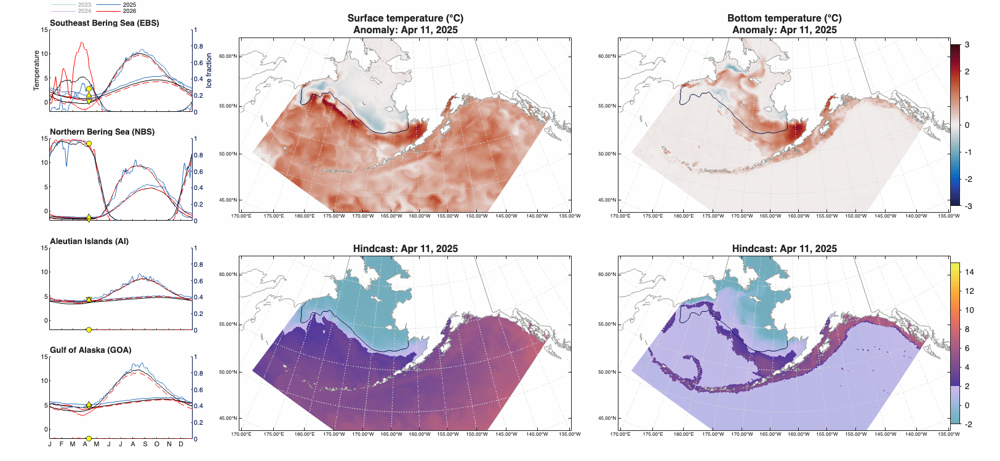
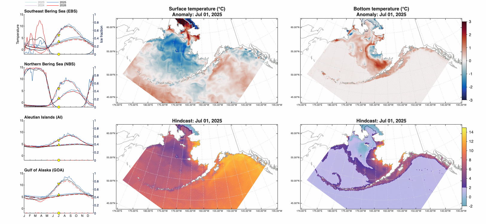
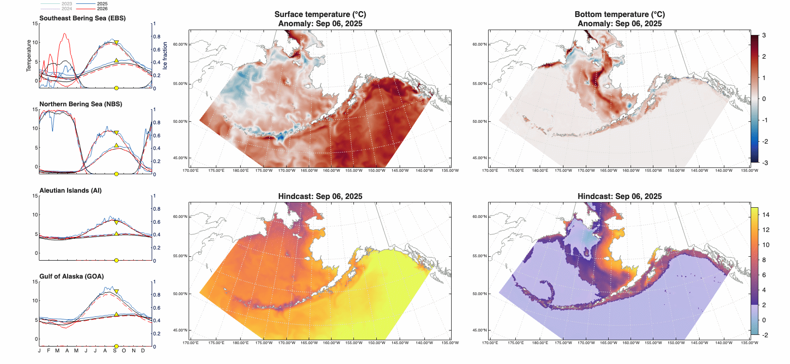
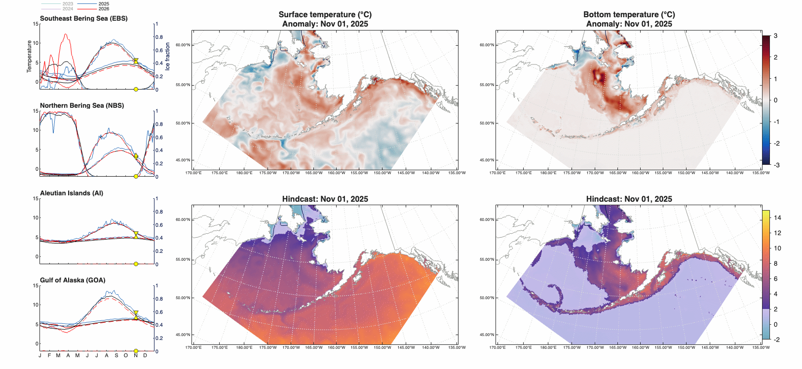
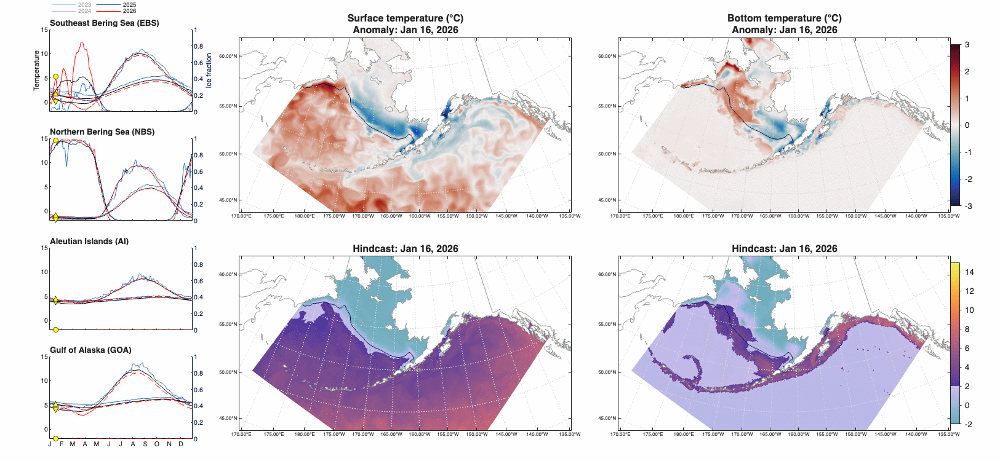
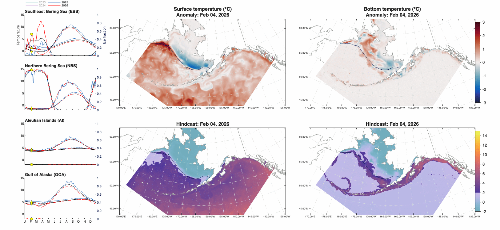
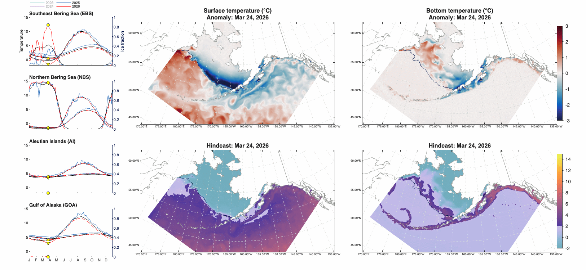
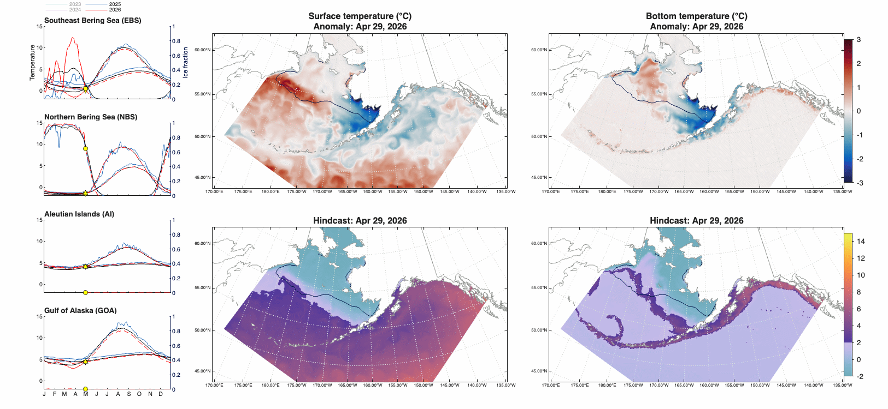

# PEEC 2026: Analysis {#sec-peecanalysis2026}

## 2025 corrigenda

We began our segment of the 2026 Spring PEEC presentation by highlighting the corrections made to the previous year's PEEC simulation, and directed users to the updated 2025 Spring PEEC Analysis (@sec-peecanalysis2025) on this website for corrected versions of the 2025 slides.

## Temperature and sea ice animations

We then presented animations that stepped through the evolution of sea ice and surface and bottom temperature between summer 2025 and spring 2026.  The following code generated these animations:


<details>
<summary>Code</summary>

```{matlab code-fold="true"}

```

</details>


<!-- ```{matlab filename="peec2026_animations.m"}
%| file: ./scripts/peec2026_animations.m
%| eval: false
%| code-fold: true
%| code-summary: "PEEC 2026 sea ice and temperature animated gifs script"
``` -->

The left-hand panels show timeseries of sea ice, surface temperature, and bottom temperature over the past two years, with 2025 in blue and 2026 in red. The dashed red line represents the persistence forecast for 2026.  The black line is the 1993-2022 climatological mean.  On the right, maps show surface and bottom temperature anomalies (top) and values (bottom), with the sea ice edge (5% ice contour) in navy.  The animations start on April 11, 2025, which was the end date of the hindcast simulation presented at the 2025 Spring PEEC meeting.

{#fig-peec26-anim1}

{#fig-peec26-anim2}

{#fig-peec26-anim3}

{#fig-peec26-anim4}

{#fig-peec26-anim5}

{#fig-peec26-anim6}

{#fig-peec26-anim7}

{#fig-peec26-anim8}

{#fig-peec26-anim9}

## Temperature and sea ice maps and indices

We then presented our standard time series and map figures, which show regionally-averaged time series two ways (left: emphasizing interannual variations in summer values, and center: emphasizing seasonal variations), plus maps of the spring anomaly and summer forecast value.

Key points from these figures:

Surface temp: 

- cool in GoA and eastern AI
- warm in western AI
- cold EBS (especially Bristol Bay) but warm WBS
- neutral NBS

Bottom temp:

- split Bering: cold SEBS, warm northwest, neutral NEBS
- split GoA: cold west and warm east
- AI: warm-ish

Cold pool:

- large 2C
- small 0C


```{matlab}
%| label: fig-peec25-indices-and-maps
%| fig-cap: "From right to left: variable values over time (grey line = daily hindcast values, red line = persistence forecast values, green circles = July 1 values, red circle = July 1 persistence forecast values); variable values versus day of year, highlighting the most recent 4 years with forecast values in the red dashed line; and maps of the (top) spatial anomaly on the last simulated date and (bottom) predicted value based on this anomaly overlaid on July 1 climatological conditions."
%| fig-subcap:
%| - Bottom temperature
%| - Surface temperature
%| - Sea ice fraction
%| - 2 degree cold pool index
%| - 0 degree cold pool index
%| code-fold: true

% Setup

addpath('../code');

savetofile = false;
outfol = '~/Documents/Conferences/202605_SpringPEEC/slides/';

% Dataset details

C = cefiportalopts('portalpath', '~/Documents/Data/CEFI/ak_cefiportal/', ...
                   'region', 'nep', ...
                   'release', 'e202604', ...
                   'freq', 'daily', ...
                   'yyyymmdd', '20240101', ...
                   'subdomain', 'iq0-342jq446-743'); 

yr = 2026;

% Regions to plot (survey region masks)

regnum = [98 143 52 47]; % EBS, NBS, AI, GOA
regname = ["EBS", "NBS", "AI", "GOA"];
reglong = ["Southeast Bering Sea", "Northern Bering Sea", "Aleutian Islands", "Gulf of Alaska"];

% Variable setup: which ones do we plot?

vplt = ["tob", "tos", "siconc", "cpool2p0", "cpool0p0"];

% Read surveyavg indices from file

Tbl = readindexdata(C.setopts('subdomain', 'aksvyreg'), ...
    'regnum', regnum, ...
    'vars', vplt);

tfc = Tbl.Fc.t(1);      % forecast start date
tpr = datetime(yr,7,1); % summer prediction date
tfc.Format = 'MMM dd, uuuu';
tpr.Format = 'MMM dd, uuuu';

% Remove leap days from climatology

isleap = month(Tbl.Clim.t) == 2 & day(Tbl.Clim.t) == 29;
Tbl.Clim = Tbl.Clim(~isleap,:);

% Map setup for anomaly/forecast maps

A = akmapprep('cpopts', C, 'maskvar', 'mask_esr_area', 'maskval', [1 3 4], ...
    'latbuffer', 0.01, 'lonbuffer', 0.01);

nreg = length(regnum);
tilesz = [nreg 5];

% Variable info table

V = ak_variable_info;

% Read map slice data

MapAnom = readmom6mapslice(C, Tbl.Fc.t(1), ...
    'vars', setdiff(vplt, ["cpool2p0", "cpool0p0"]), 'vartype', 'anomaly');
MapFc = readmom6mapslice(C, datetime(yr,7,1), ...
    'vars', setdiff(vplt, ["cpool2p0", "cpool0p0"]), 'vartype', 'fcpersist');
MapAnom.cpool2p0 = MapAnom.tob;
MapAnom.cpool0p0 = MapAnom.tob;
MapFc.cpool2p0 = MapFc.tob;
MapFc.cpool0p0 = MapFc.tob;close

% Slide figures

for iv = 1:length(vplt)

    % Figure and tiling setup

    h = struct;
    h.fig = figure('color', 'w');
    h.fig.Position(3:4) = [1300 600]; % slide size
    h.t = tiledlayout(tilesz(1), tilesz(2));
    h.t.TileSpacing = 'loose';
    h.t.Padding = 'compact';

    % Plot index timeseries

    for ir = 1:length(regnum)
        h.ax(ir,1) = nexttile(tilenum(h.t,ir,1), [1 2]);
        h.ts(ir) = plotsurveyregionindex(Tbl, vplt{iv}, 'col', ir, ...
            'style', 'date_vs_val_annual_and_daily');

        h.ax(ir,2) = nexttile(tilenum(h.t,ir,3));
        h.doy(ir) = plotsurveyregionindex(Tbl, vplt{iv}, 'col', ir, ...
            'style', 'doy_vs_val_lines');
    end

    % Prettify timeseries

    set([h.ts.lnsummer h.ts.lnfcsummer], 'markersize', 4, 'linewidth', 1.5);
    set(h.ax, 'ylim', V{vplt{iv}, 'limsvyavg'}, 'fontsize', 8, 'box', 'off');
    labelaxes(h.ax(:,1), compose("%s (%s)", reglong', regname'), 'northwestoutsideabove', 'fontweight', 'b');
    arrayfun(@(x) uistack(x, 'top'), [h.ts.lnsummer])

    h.leg(1) = legend([h.ts(1).lndaily, h.ts(1).lnsummer, h.ts(1).lnfc], ...
        ["Hindcast (daily)", "Hindcast (Jul 1)", "Forecast"], ...
        'numcolumns', 2, 'location', 'northeast', 'box', 'off');
    h.leg(1).Position(2) = h.ax(1,1).Position(2)+h.ax(1,1).Position(4);
    h.leg(1).Position(1) = h.ax(1,1).Position(1)+h.ax(1,1).Position(3)-h.leg(1).Position(3);
    
    h.leg(2) = legend(h.doy(1).lndoy(end-3:end), string((-3:0)+yr), ...
        'numcolumns', 2, 'location', 'northwest', 'box', 'off');
    h.leg(2).Position(2) = h.ax(1,2).Position(2)+h.ax(1,2).Position(4);
    h.leg(2).Position(1) = h.ax(1,2).Position(1);

    % Plot maps

    h.max(1) = nexttile(tilenum(h.t,1,4), [2 2]);
    h.m(1) = plotmom6akmap(A, MapAnom, ...
        'var', vplt{iv}, 'vartype', 'anomaly', ...
        'mapprops', {'mticks', 'b', 'pticks', 'l'});
    
    h.max(2) = nexttile(tilenum(h.t,3,4), [2 2]);
    h.m(2) = plotmom6akmap(A, MapFc, ...
        'var', vplt{iv}, 'vartype', 'value', ...
        'mapprops', {'mticks', 'b', 'pticks', 'l'});

    % Prettify and label maps

    set([h.max], 'fontsize', 6, 'box', 'on');

    title(h.max(1), {V{vplt{iv}, 'labelname'}, "Anomaly: "+string(tfc)}, 'fontsize', 12);
    title(h.max(2), "Prediction: "+string(tpr), 'fontsize', 12);

    h.m(1).cb.Position(1) = 0.95;
    h.m(2).cb.Position(1) = 0.95;
    set([h.m.cb], 'axislocation', 'out', 'fontsize', 10, 'tickdir', 'out');

    % Save to file

    if savetofile
        export_fig(h.fig, fullfile(outfol, sprintf('peec_persisfc_%s', vplt{iv})), '-png', '-r150', '-nocrop');
    end
end
```

## Cluster analysis

Our final slide presenter cluster analysis based on the spring anomaly in surface and bottom temperature across the three primary Alaska ESR regions.  This revealed no particularly close analogue years, with 2026 clustering less tightly than most years.  The pattern seen in 2026 is not extreme, but it is unusual.

```{matlab}
%| label: fig-peec26-cluster-allESR
%| fig-cap: Cluster analysis based on surface and bottom temperature averaged over Apr 1-30 across the three Alaska ESR regions.
%| code-fold: true
%| code-eval: false

[hclus, Cdata] = cluster_on_anomalies(...
    [4 1], ...
    'cpopts', C, ...
    'yr', 1993:2026, ...
    'maskval', [1 3 4], ...
    'ndays', 30, ...
    'verbose', false);
```

Early forecasts of El Nino were released just prior to the Spring PEEC meeting, and suggested a high probability of a strong El Nino event beginning in the coming months.  Given this, we examined our hindcast simulation to see if there were any compelling patterns in Alaska region temperature that correlated with ONI or other metrics of ENSO strength.  However, we did not find any immediate ENSO-related patterns, even in the Gulf of Alaska region where one might expect the warming signal to propagate from the south.  We expect ENSO to be one of several drivers impacting Alaska region temperatures over the coming year, but the impact will not be as straightforward as one might see in more equatorial regions.