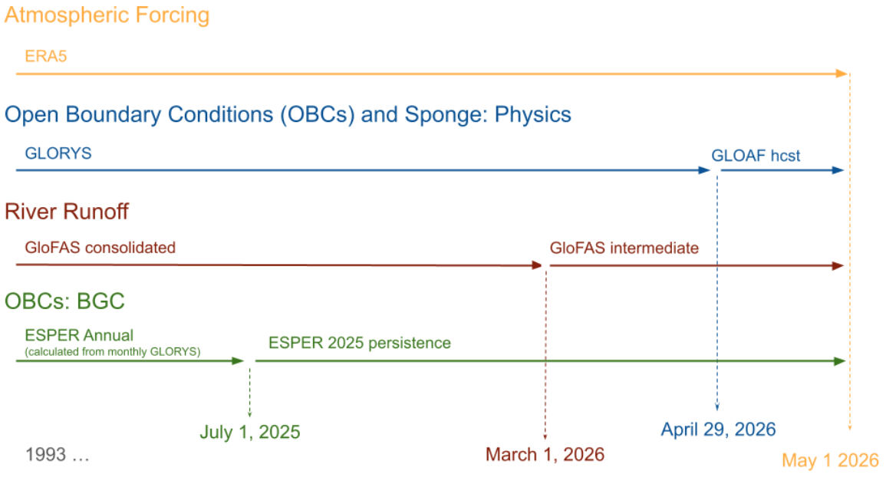

# PEEC 2026: Methods

## Simulation details

For the 2026 Spring PEEC, an updated version of the MOM6-NEP hindcast was run, extending through Apr 30, 2026.  This version differs slightly from the previous release of MOM6-NEP (used for the 2025 pre-ESR analysis).  The primary changes to the configuration were as follows:

 - The executable was recompiled to use the new ifort compiler and to use the most recent CEFI-stable version of the MOM6 code base
 - The output diagnostics table (i.e., `diag_table`) that describes which variables should be saved and at which spatial and temporal resolution was updated to use the CEFI default configuration.
 - input parameters for SIS and MOM (i.e., `SIS_input` and `MOM_input`) were updated to be consistent with the NWA configuration when there was not a specific justification for a difference
 - open boundary conditions and initial conditions now use the 2023 release of the World Ocean Atlas (WOA23) rather than the previous 2018 release.
 - Atmospheric CO~2~ forcing was updated to the version 2 file, with latitudinal variation rather than a global mean, that is now the CEFI standard.
 - sea ice is now initialized from the GLORYS dataset
 - u/v sponges (i.e., light nudging of velocities) were added near the grid boundaries to eliminate some numerical articfacts that were appearing along the western and southern boundaries.

The general NEP10k hindcast extension builds on the methodology detailed in @drenkard_regional_2025. For atmospheric forcing, we used ERA5 surface winds, temperature, precipitation, sea level pressure and downwelling solar and thermal radiation. Open boundary conditions and boundary sponges for temperature, salinity, velocities, seasurface height were generated from GLORYS. At the time of simulation, the GLORYS Reanalysis only extended to April 28, 2026. Therefore, for subsequent days for the open boundary conditions, we used output from the GLORYS Analysis and Forecast product. Diminishing persistence weighting, specifically weighting to the last day of the Reanalysis, was applied to the GLOAF hindcast to mitigate any localized discontinuities between the GLORYS Reanalysis and GLOAF hindcast products. The 2026 date ranges for each product used for daily boundary conditions for days beyond the extent of the GLORYS reanalysis were: April 29-May 1 (weighted GLORYS hindcast). The sponge for April was generated from only the GLORY (i.e., the monthly mean was generated from the first 28 days in April) while the May sponge was a persistence of the April sponge. Freshwater runoff was prescribed using the consolidated GloFAS product up until February 28, 2026; after this date, we used the GloFAS intermediate product.
Biogeochemistry boundary conditions were prescribed as climatologies with the exception of total alkalinity and dissolved inorganic carbon. These boundary terms were defined as annual mean values, generated using ESPER and monthly temperature and salinity fields from GLORYS. Unique annual means were calculated through 2025; boundary conditions for 2026 were prescribed as a persistence of the 2025 annual mean values. 

See @tbl-esr25force for details regarding the datasets mentioned in this section.

{#fig-peec26force}

## Dataset extraction

Building on the methodology from the 2025 pre-ESR analysis, we extracted selected variables from the hindcast within the Alaska management bounding box [@fig-mom6gridmap].  We then calculated an updated baseline climatology (1993-2023), anomalies from climatology, and peristence forecast values for all extracted variables.  Finally, we calculated spatially-averaged indices for all of these using the Alaska survey region masks (the masking variables were simply copied from the previous e202507 simulation rather than recalculating, since neither the akgfmaps polygons nor the MOM6-NEP grid variables have changed.)

:::{.callout-note}
The 2026 partial year extension was run as an entirely separate simulation from the 1993-2025 hindcast, and was saved as such on the GFDL archives.  For the PEEC, I extracted and named the 2026 data files as though they were part of the primary hindcast, for ease of analysis during this quick turnaround time.  This may change in the future as we develop workflows and naming schemes for these simulations.

Please note that the 2026 simulation data files use a different reference date (2026-01-01) than the rest of the hindcast (1993-01-01).
:::

```{bash filename="peec2026_data_extract.sh"}
#| file: ./scripts/peec2026_data_extract.sh
#| eval: false
#| code-fold: true
#| code-summary: "PEEC 2026 data extraction script"
```

